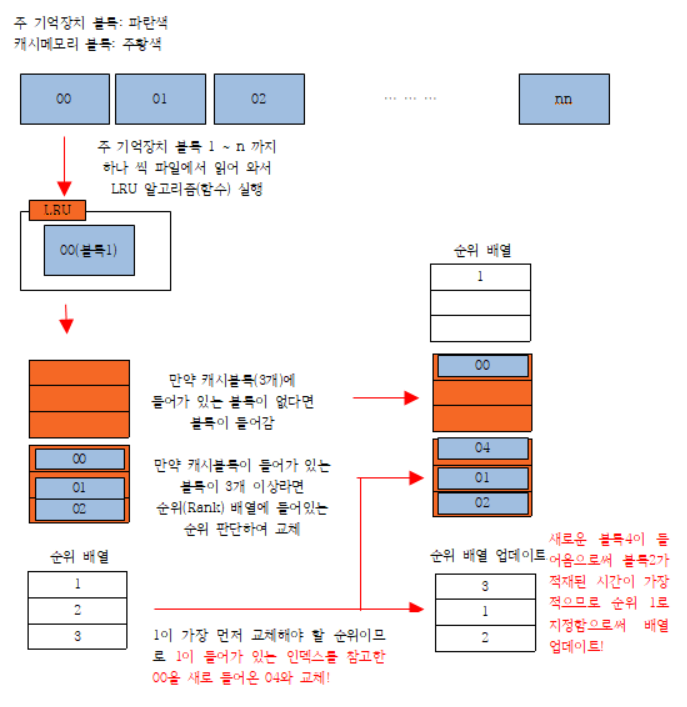
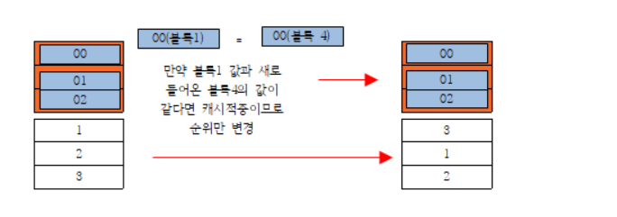

# Cache-Memory-Replacement-Algorithm-LRU-
JAVA를 이용한 캐시 메모리 교체 알고리즘(LRU)

> ### 프로그램 작성 및 시연  

 1) 완전 연관 매핑 방식 사용  
 2) 입력조건  
   - 'input.txt' 파일을 열어 요청 주기억장치 블록 번호들을 차례로 읽어서 처리  
      → 윈도우의 TXT 편집기 사용  
      → 두자리수의 주기억장치 블록 번호(00~98)를 사용하며 99 가 입력될 때까지 진행 후 종료  
        입력 값 99 는 주기억장치 블록 번호가 아니고 종료의 의미 → 입력으로 처리하지 않음  
      → 입력되는 전체 주기억장치 블록의 개수는 30 개 이하로 설계  
 3) 출력 조건
   - 각각의 프로그램은 종료시 화면에 현재 각각의 캐시블록에 들어 있는 주기억장치 블록번호와  
     적중률을 한 줄에 표시  
          
> ### 사용 기술 

 * 랭크 업데이트
<pre>
<code>
public void RankUpdate(int i) {
		if(rank[1]== 0) { rank[i] = 1; } // 캐시 메모리 블록에 데이터가 1개 들어있을 시 
		else if(rank[2]==0) { rank[i] = 2; rank[(i+3)%2] = 1; } // 캐시 메모리 블록에 데이터가 2개 들어있을 시 
		else { // 캐시 메모리 블록에 데이터가 3개 들어있을 시 
			rank[i] = 3;
			int p = (i+4)%3; int q = (i+2)%3;
			if(rank[p] > rank[q]) { rank[p] = 2; rank[q] = 1; }
			else { rank[p] = 1; rank[q] = 2; }
		}
	}
</code>
</pre>  
  
 * 프로세스 바 업데이트  
<pre>
<code>
try {
			File file = new File("input-txt.txt");
			for (String line : Files.readAllLines(file.toPath())) {
			    for (String part : line.split("\\s+")) {
			    	if(Integer.parseInt(part) >= 99 || index>=30) break;
			    	block[index++] = part;
			    	cacheBlock.LFU(part);
			    	cacheBlock.ProgressUpdate();
			    	cacheBlock.ProgressRankUpdate();
			    }
			}
		} catch (NumberFormatException e) {
			// TODO Auto-generated catch block
			e.printStackTrace();
		} catch (IOException e) {
			// TODO Auto-generated catch block
			e.printStackTrace();
		}
</code>
</pre>  

  
> ### 소스코드 설명

   
   
